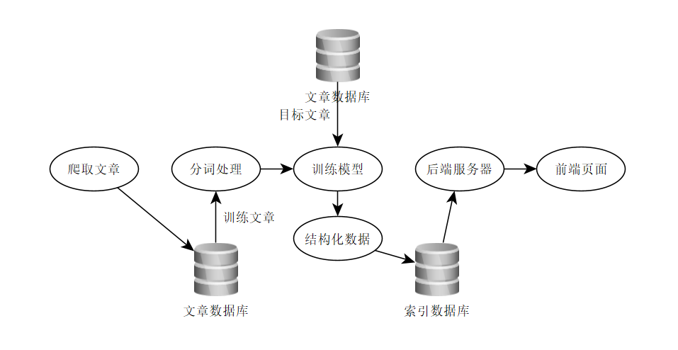

# AsYouThink

总体规划：

爬虫从网上获取相关的文章数据，之后交给分词系统处理并训练模型，之后使用模型将目标文章的索引信息提出出来，并使用结构化的模式存储到索引数据库中（可能是Mysql，分布式最佳），之后就是正常的JAVAEE项目，获取数据并展示，加上相应的查询。

定义各部分的任务：

## 1. 前端
负责数据的展示与相关查询的入口
- 定义Web页面
    - 搜索主页：发挥创意，简洁设计
    - 统计展示界面，求高级与简洁并存
- 定义Json规格
    - 简要说明各种需要的Json规格，并给出示例

## 2. 后端
负责数据的处理
- 定义实体类型：前端工作直接查询的实体，力求完善

## 3. 爬取
负责爬取数据
- 从网站上爬取文章
    - 说明：首先自行练手，任何网站上均可，爬到一定数量即可
- 将数据存储到数据库中
    - 待定，正在研究用什么数据库

## 4. 分词
负责处理文章
- 从数据库中读取文章
- 处理文章得到结果
- 进阶
    - 研究人工智能算法
    - 尝试分布式计算

## 5. 数据
负责数据的存储研究
- 文章类型数据存储
- 查询数据的存储
- 如何自动更新数据